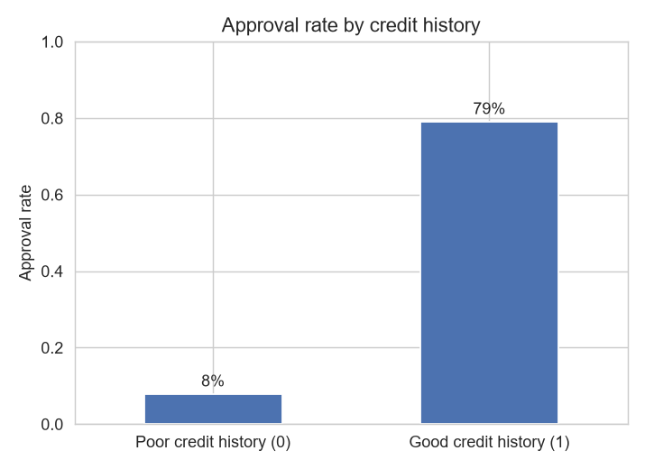
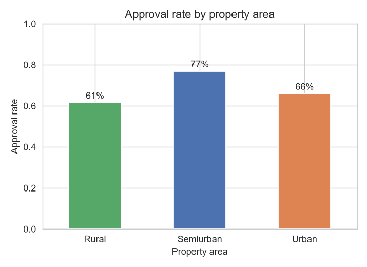
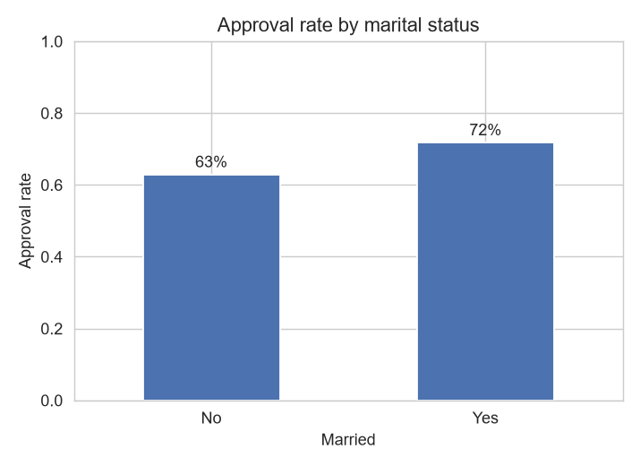
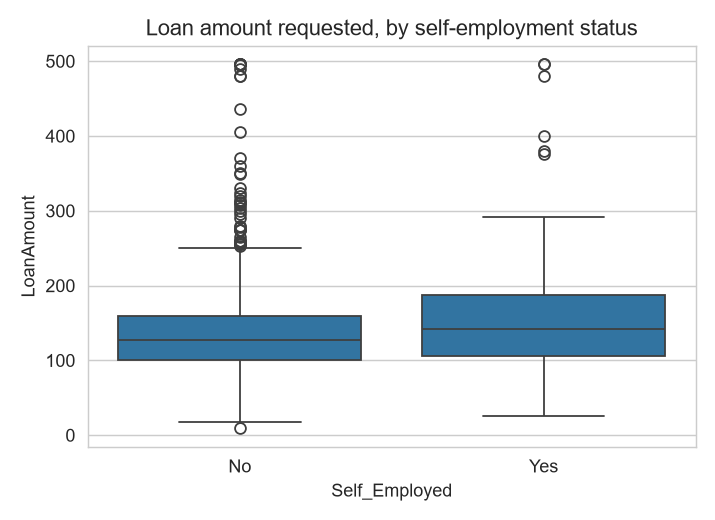
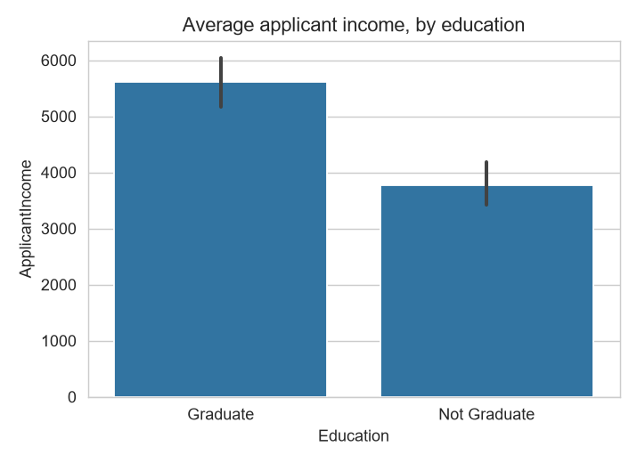

# Loan Approvals: 5 Things The Data Shows

A look inside 614 real home-loan applications to Dream Housing Finance.
No spreadsheet knowledge needed — just the charts and the story.

---

## 1. Your credit history decides almost everything

**Applicants with a good credit history are approved about 79% of the time —
applicants with a poor one, only 8%.** Nothing else in this data comes close
to that gap.

---

## 2. Where you live matters more than you'd guess

**Semiurban applicants get approved the most (77%)** — more than urban (66%)
or rural (61%) applicants. It's not the simple "big city = best odds" pattern
you might expect.

---

## 3. Married applicants do a bit better

**Married applicants are approved about 72% of the time, vs. 63% for
unmarried applicants.** A smaller gap than credit history, but a real one.

---

## 4. Self-employed applicants ask for more — and it doesn't cost them

**Self-employed applicants request bigger loans on average (~₹167k vs.
~₹141k)** — but their approval rate is nearly the same as salaried
applicants. Asking for more money, on its own, doesn't seem to hurt.

---

## 5. Income barely matters — even though it varies a lot

**Graduates earn about 48% more on average than non-graduates** — but income
has almost zero relationship (correlation of 0.003) with whether the loan
actually gets approved. More money doesn't buy a better chance; a good
credit history does.

---

## The bottom line

If you only remember one thing: **credit history is king.** Everything else
in this data — income, education, self-employment, even marital status and
location — plays a distant second to whether you've paid past debts on time.

*Full analysis and code: `notebooks/advanced_eda.ipynb`*
